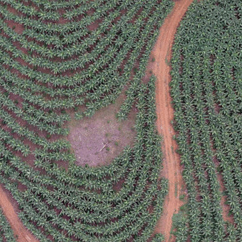
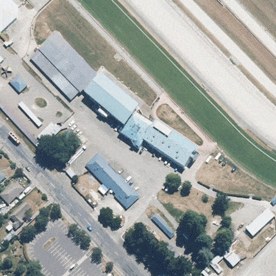
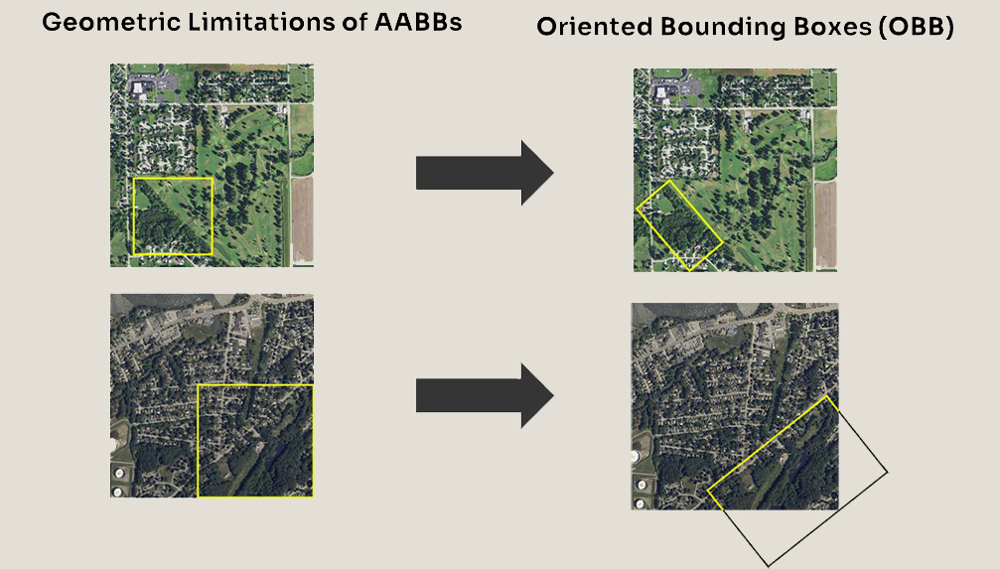

# Tree Canopy Detection: High-Density Instance Segmentation in Aerial Imagery

## Overview

This repository contains the code and methodology for the Tree Canopy Detection Competition [hosted by Solafune]. The primary objective is to detect tree canopies across multiple resolutions of aerial and satellite imagery and categorize them into two classes: Individual Tree and Group of Trees. Additionally, the pipeline classifies the scene types.

## Problem Statement & Challenges

Detecting tree canopies in high-density environments presents several significant challenges:

* **Tiny Instances:** The dataset contains mostly tiny instances, often exceeding 1000 instances per image.

* **Limited Training Data:** Only 150 samples for training.

* **Varied Ground Sample Distance (GSD):** The images have highly variable GSDs, specifically 10, 20, 40, 60, and 80.

* **Diverse Scene Types:** The model must generalize across varied scenes, including agriculture plantations, urban areas, rural areas, industrial areas, and open fields.

## Methodology
To address the challenges of small training data and highly dense objects, I implemented a Multi-Stage Instance Segmentation Pipeline.

### Stage 1: Scene Classification
Because the evaluation metric requires scene types, the pipeline first passes the input image through a scene classifier.

* **Ensemble Approach:** Uses an ensemble of three fine-tuned ConvNeXt-Small models.
* **Output:** Classifies the image into one of five categories (Agriculture Plantation, Urban Area, Industrial Area, Rural Area, Open Field).

### Stage 2: Scale-Aware Object Detection (Ensemble + SAHI)

#### 1. Pre-training & Fine-tuning

* **Pre-training:** YOLOv8m and YOLO11x models pre-trained on larger datasets ->  OAM-TCD dataset (~4000 samples) and the OliveTree Dataset (~46 samples).

* **Finetuning:** Used the pre-trained base models to finetune on the competition dataset using a smaller learning rate and GSD-weighted sampler.

#### 2. Prediction & Inference

* **Dynamic Inference:** Standard prediction for low GSD samples. For higher GSDs (60 and 80), the image was scaled up (1792x1792) and then processed using Slicing Aided Hyper Inference (SAHI) to improve small object detection.

* **Bounding Box Merging:** Applied Weighted Boxes Fusion (WBF) to merge the resulting bounding boxes effectively.

### Stage 3: Instance Segmentation (SAM 2)

* **Prompting SAM2:** Finally, used those refined bounding box outputs as prompts for the Segment Anything 2 Model (SAM2) to generate precise instance masks.

## Evaluation Metric
The competition uses a custom **Weighted Mean Average Precision (weighted mAP)**. Instead of treating all images equally, the metric assigns weights to each image based on its scene type and GSD resolution.

$$mAP_i = \frac{1}{C_i} \sum_{c=1}^{C_i} AP_{i,c}$$

$$w_i = w_{\text{scene}(i)} \cdot w_{\text{resolution}(i)}$$

$$\text{weighted mAP} = \frac{\sum_{i=1}^{N} w_i \cdot mAP_i}{\sum_{i=1}^{N} w_i}$$

## Results
#### Quantitative Performance

* **Private Score:** The final submission achieved an evaluation score of 0.4014.

* **Global Standing:** This pipeline secured Rank 32 out of 578 participants.

#### Qualitative Results
Below is a visual demonstration of the pipeline's robust segmentation capabilities. Notice how the model seamlessly handles both dense agricultural plantations and generalizes well in urban canopies:

<table align="center">
  <tr>
    <td></td>
    <td></td>
  </tr>
</table>

## Discussion & Future Work

While the multi-stage pipeline proved highly effective, further optimizations could address certain bottlenecks:

* **Bounding Box Geometry:** Because tree groups frequently align diagonally or at irregular angles, standard Axis-Aligned Bounding Boxes (AABBs) end up capturing large amounts of background space. Using Oriented Bounding Boxes (OBBs) would provide a much tighter fit and reduce noise for the segmentation model.

* **Direct Segmentation:** Future iterations could explore direct (end-to-end) segmentation models like Mask2Former or YOLO-Seg. This would eliminate the "Box Bottleneck" entirely by eliminating the need for Non-Maximum Suppression (NMS) or WBF, while also benefiting from Mask2Former's scale invariance.

## Acknowledgments & References

* **[1]** Solafune. "Tree Canopy Detection Competition." *Solafune*, 2025. [Online]. Available: [https://solafune.com/competitions/26ff758c-7422-4cd1-bfe0-daecfc40db70](https://solafune.com/competitions/26ff758c-7422-4cd1-bfe0-daecfc40db70)
* **[2]** J. Veitch-Michaelis *et al.*, "OAM-TCD: A globally diverse dataset of high-resolution tree cover maps," *Advances in Neural Information Processing Systems (NeurIPS)*, vol. 37, 2024. [Online]. Available: [https://arxiv.org/abs/2407.11743](https://arxiv.org/abs/2407.11743)
* **[3]** Y. Hnida *et al.*, "OliveTreeCrownsDb: A high-resolution UAV dataset for detection and segmentation in agricultural computer vision," *Data in Brief*, vol. 60, p. 111515, 2025. doi: [10.1016/j.dib.2025.111515](https://doi.org/10.1016/j.dib.2025.111515)

